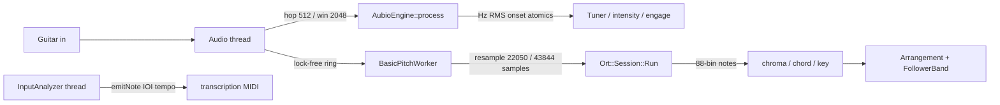

# Dual-pipeline tracker

Forget The Band listens on two clocks:



## Who does what

| Signal | Engine | Thread | Feeds |
|--------|--------|--------|-------|
| Onset, RMS, YIN Hz | aubio `hfc` + `yinfft` | **Audio** (`AubioEngine::process`) | `consumeOnset`, intensity, tuner, `hasEngaged` |
| Polyphony, chroma, chord, key | Spotify Basic Pitch `nmp.onnx` | **Worker** | `copyChroma`, `playerChordRoot/Deg`, auto key |
| Tempo | aubio onset IOIs (median) | Worker lock | `getBpm` until Lock Tempo |
| Named notes / MIDI | aubio (or homemade YIN fallback) pitch | Worker | `drainMidi`, export MIDI, solo HUD |

Homemade YIN stays as fallback if `aubio.prepare()` fails.

## Band state

- `onset && rms high` → `onsetFlag` (fills via `consumeOnset`) + intensity bump
- Basic Pitch chord change → `playerChordRoot` / `playerChordDeg` so Arrangement / FollowerBand shift bass and keys
- YIN `midiNote` still drives transcription and the solo HUD
- Soft engage: `rms > 0.006` and (`conf > 0.22` or onset or `activity > 0.10`). No timeout auto-start.

## Thread rules

- **Audio thread never** calls `Ort::` anything, `new_aubio_*`, `del_aubio_*`, or `new`/`delete`.
- **Audio thread may** call `AubioEngine::process` (only `aubio_onset_do` / `aubio_pitch_do` / RMS on existing objects) and `BasicPitchWorker::pushSamples`.
- `new_aubio_onset` / `new_aubio_pitch` live in `AubioEngine::prepare` (device start).
- `Ort::Env` / `Ort::Session` are created at the start of `BasicPitchWorker::run`, never on the audio thread.

## Basic Pitch model

Constants from `spotify/basic-pitch` `basic_pitch/constants.py` (do **not** use 2048 as the ONNX window):

- `AUDIO_SAMPLE_RATE = 22050`
- `FFT_HOP = 256`
- `AUDIO_WINDOW_LENGTH = 2` seconds
- `AUDIO_N_SAMPLES = 22050*2 - 256 = 43844`
- `N_FREQ_BINS_NOTES = 88` (A0 = MIDI 21)
- `ANNOT_N_FRAMES = (22050//256)*2 = 172`

ONNX names from `inference.py`:

- Input `serving_default_input_2:0` shape `[1, 43844, 1]`
- Outputs: note `StatefulPartitionedCall:1`, onset `StatefulPartitionedCall:2`, contour `StatefulPartitionedCall:0`

Search order at runtime:

1. Next to `ForgetTheBand.exe` (`basic_pitch.onnx`) — CMake copies it here (user can drop a newer model)
2. `Assets/Models/basic_pitch.onnx` next to the exe
3. `Documents/Centrophy/ForgetTheBand/models/basic_pitch.onnx`
4. **Embedded** `Assets/Models/basic_pitch.onnx` via `juce_add_binary_data` (`SessionModel`) if no sidecar

If ORT is missing, `isAvailable()` is false and the worker skips `Run`. No crash.
The sidecar is optional; the 230 KB model is also compiled into the exe.

Source of the weights: [nmp.onnx](https://github.com/spotify/basic-pitch/raw/main/basic_pitch/saved_models/icassp_2022/nmp.onnx) (Apache-2.0). See `Assets/Models/LICENSE.txt` and `NOTICE.txt`.
ONNX Runtime (`onnxruntime.dll`) is MIT (Microsoft). Official prebuilt DLL only; source is not vendored.

## CMake flags

```
FTB_ENABLE_AUBIO=ON          # default; compiles aubio 0.4.9 C sources (no waf)
FTB_ENABLE_ONNX=ON           # default
FTB_ONNXRUNTIME_ROOT=<path>  # optional prebuilt onnxruntime (include/ + lib/)
```

If `FTB_ONNXRUNTIME_ROOT` is empty, configure downloads
`onnxruntime-win-x64-1.19.2` into `build/_deps/onnxruntime`. Keep `build/_deps`
when refreshing the source tree so JUCE is not re-fetched.

Compile defs `FTB_HAS_AUBIO=1` / `FTB_HAS_ONNX=1` are set when the dependency
is actually found. The tracker compiles if either is off.
